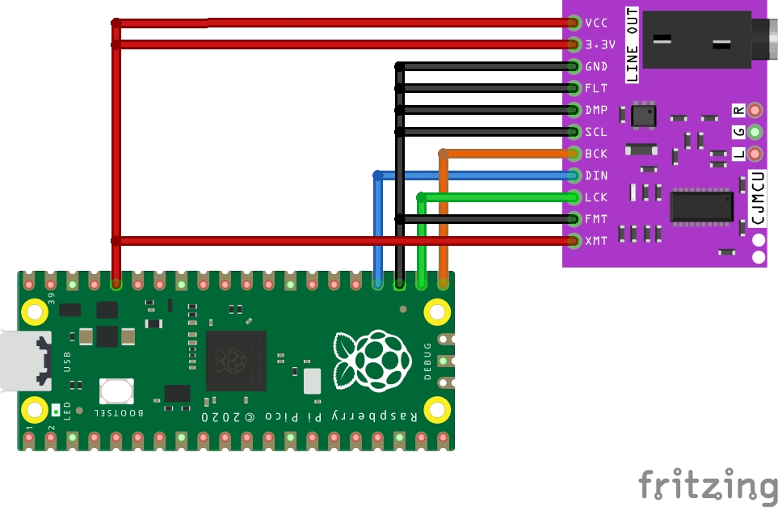

# RP2040 USB DAC

A 48kHz/16bit (only) USB DAC built upon RP2040 (MCU) and PCM5102 (the DAC itself)

## Assembly



## Support

Currently tested on Linux with Pipewire (default configs) with no complaints.

## Installation

If you intended to use RPi Pico as MCU, you need only mount and run

```shell
cargo run --release
```

from repository root.
Otherwise, adjust the program for you board. E.g. change BSP, clock config, pins, etc.
