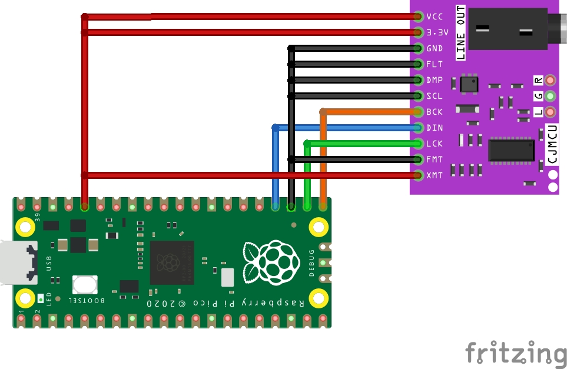

# RP2040 USB DAC

Multi sample rate (48kHz, 96kHz), multi bit depth (16bit, 24bit) USB DAC built upon RP2040 (MCU) and I2S DAC

## Assembly Example



## Support
| OS      | Linux (Pipewire) | Windows | MacOS |
|---------|------------------|---------|-------|
| Tested? | Yes              | No      | No    |

## Configuration

Seek for similar following code block for audio configuration:

```rust
// =======================================================================
// AUDIO CONFIG START
// =======================================================================


const SAMPLE_RATE: usize = 48000;	    // 48k or 96k
const USB_CHANNELS: usize = 2;	    // TODO now only 2 works
const USB_BYTE_DEPTH: usize = 2;	    // 2/3/4 byte (16/24/32 bit)


// =======================================================================
// AUDIO CONFIG END
// =======================================================================
```

Seek for similar following code block for pins configuration:

```rust
// ===================================================================
// PIN CONFIG START
// ===================================================================


let DIN_GPIO = pins.gpio18;	// aka SDIN, SD, SDATA, DACDAT
let LRCK_GPIO = pins.gpio17;	// aka LCK, WS
let BCLK_GPIO = pins.gpio16;	// aka BCK, SCK


// ===================================================================
// PIN CONFIG END
// ===================================================================
```


## Installation

For RPi Pico as RP2040 carrier:

```shell
$ cargo run --release
```
